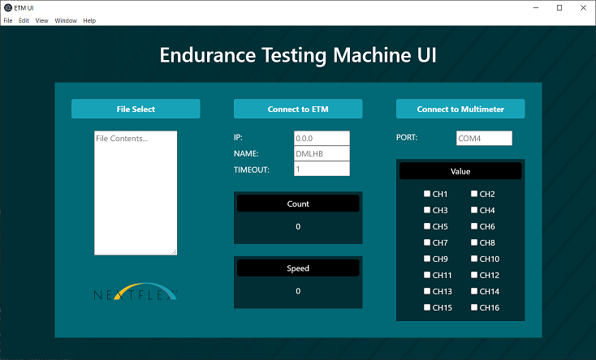

# ETM-UI-offline

### Endurance Testing Machine User Interface (Offline Version)

_Screenshot of ETM UI_

## Description

This is an electron Project containing source code for a Desktop Application which serves as the interface for the Endurance Testing Machine at Nextflex

At this time, the application is simply a faceplate and not connected to the back-end

## Initializing Project

Due to Githubs 100MB size limit, the node_modules folder for this project has been ommitted.
As a result, it must be initialized with [Electron Forge](https://www.electronforge.io/) before use.

To initialize it using npm, run the following command:

`npx create-electron-app etm-ui`

Next, copy the project files from this repo over and install dependencies.

## Installing Dependencies

This project uses bootstrap, jquery, and poppers. Installing these dependencies requires the following commands:

`npm install bootstrap`

`npm install jquery`

`npm install @popperjs/core`

## Usage

This project is meant to be run with node.js using `npm install` then `npm start` in package directory
